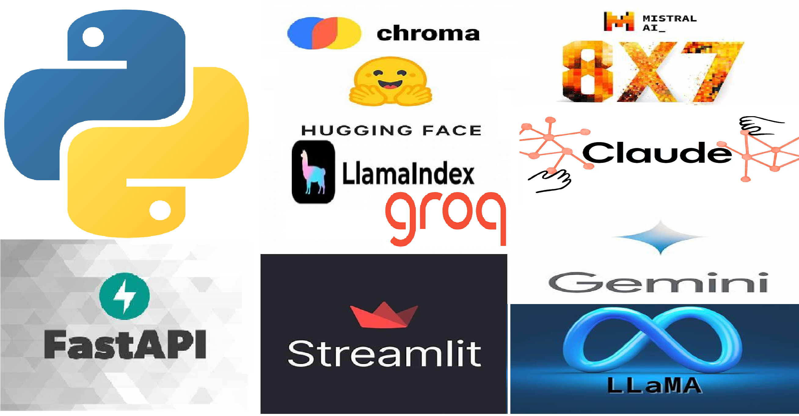
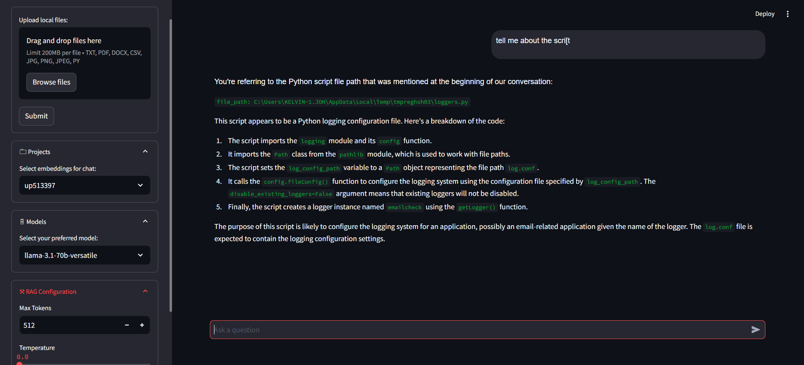

# ragex

Leveraging LlamaIndex, ChromaDB, this RAG system is designed to process data from files of varying formats. This system can ingest data from files, store them in a ChromaDB vector database, and be used to query them with precision thanks to LlamaIndex’s retrieval tools.

The backend is a FastAPI server handling file upload and chat connection requests made from a Streamlit client app. 

#### System Architecture:
Programming Language             - Python  
Model Provider                   - Groq, Google Vertex  
LLM Orchestrators and Frameworks - LlamaIndex, FastAPI, Streamlit  
Operational and Vector Database  - ChromaDB, SQLite  
Monitoring and Observability     - Python Logger  
Deployment                       - Streamlit, GCP  

